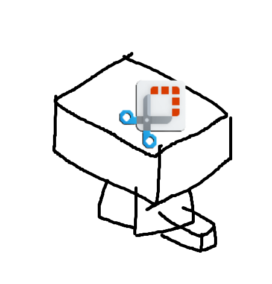

# CaptureHopper



윈도우11 캡처 도구에서 찍은 사진을 자동으로 옮겨주는 도구

## How to use
1. Git 복사하기
```
git clone https://github.com/craftingmod/capture-hopper.git
```
2. 복사한 디렉토리로 간 후 npm 셋업
```
npm i
```
3. 빌드
```
npm run build
```
4. 실행
```
node ./build/index.js
```
5. 오른쪽 알림을 클릭하여 `config.json` 수정
```json
{
  "capturePath": "", // 스크린샷 저장 경로, ""시 기본 저장 경로 사용
  "removeOrginal": false, // 옮기고 제거할 지 여부
  "moveNotification": true, // 옮길 때 알림 띄울 지 여부
  "movePattern": "" // 옮길 위치
}
```
 * `movePattern`은 옮길 위치를 지정할 수 있음. 밑의 문자열은 자동으로 사진의 날짜를 사용하여 치환 됨.
   * `{year}`: 연도
   * `{year2}`: 연도(끝 2자리)
   * `{month}`: 월(2자리)
   * `{day}`: 일(2자리)
   * `{hours}`: 시(2자리)
   * `{minutes}`: 분(2자리)
   * `{seconds}`: 초(2자리)
 * 예시
```
D:/Arcihve/{year}-{month}/스크린샷_{year2}{month}{day}_{hours}{minutes}{seconds}
```
 * 위의 설정으로 `2023년 11월 4일 오전 9시 20분 5초`에 찍힌 사진이면
```
D:/Arcihve/2023-11/스크린샷_231104_092005.png
```
 * 로 저장됨
6. 수정을 하였으면 다시 실행

7. PROFIT! 